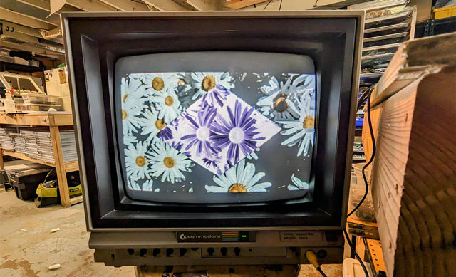

It is a Monday: the 18th of December, 2023.  At LZX we are wrapping up an exhausting year, and probably our most challenging yet.  It has been difficult to speak publicly on our ongoing plans and projects with a mammoth in the room: Chromagnon is multiple years overdue, and I have failed to accurately estimate the shipping date a few times now.  

<!-- truncate -->

Making this instrument possible has been a fight.  When circumstances have shifted and delays are suffered, I tend to freeze – preferring to bury myself in the work of pushing past the setbacks and hoping that I have better news to share later. As the months drag on, this leads to a lack of communication from us to you, and you are left with question marks, sparse information, and robbed of the choice to cheer us onward as we get closer.  

So I’ve committed to regularly reporting the weather until we get this Chromagnon job done, and beyond.  I will be doing that through posting updates on this blog, whether there is notable progress or not.  In each post, I will try to answer any questions that you write in to sales@lzxindustries.net.  

The intention is to make this an ongoing conversation and a camera angle behind the scenes -- rather than a sporadic update.

 

*Chromagnon prototype testing on the Commodore 1702*

In the next post, I’ll list our LZX stats sheet for 2023 – boards designed, goals met, projects shipped, dreams born, nightmares silenced.  

But let’s end this one with an FAQ, and get that out of the way.

**When is Chromagnon shipping?**  Knowing when exactly Chromagnon will ship is difficult to estimate. Our biggest obstacle at this stage is cashflow. The synthesizer market is volatile, and we may have to continue pivoting back and forth with other projects to keep the company going.  If there's a last minute issue with the production articles or molded parts, that could also delay us by several weeks.  We are a few months behind the latest estimates represented by the production calendar, and our plan to be shipping by the end of 2023.  The milestone we are about to hit is where I wanted to be in September.  If plans go well, the first quarter of 2024 will encompass all of the activities remaining before we ship.  That includes validation of the production assembly, development of a production test platform, and production of the molded parts.

**What happened with Chromagnon in 2023?** Low sales have hit the whole synth industry this year, and it required us to finish and ship several smaller projects (like our new module Scrolls) to make ends meet over the Summer and Fall.  It is a two steps forward, one step back situation – much like the past 3 years have been.  If we could throw all our time and resources at Chromagnon, we would -- but our survival mandates a balanced allocation. This is not a situation I like being in, but we are trying to make the best of whatever plan gets us closer to Chromagnon's shipping day.

**Where is the Chromagnon demo video?** I would prefer to not show the hardware output until the production first article passes our testing.  The current prototype represents a huge step toward completing the project, but it seems best to wait until it's all 100% before investing time in filming a functional walkthrough.  After this week, production article testing is our next milestone to hit.  From that milestone, my R&D workload lessens significantly, and filming an exhaustive video walkthrough becomes the priority.  

**How is it going, Lars?!** Outside of the beleaguered pre-order scenario, I am very happy with how Chromagnon has taken shape, and the past several weeks of work represent moving past the point of any remaining design issues and implementation decisions. It is still an instrumentation concept I am quite passionate about, and it has been very rewarding bringing it to life. I am grateful for the support and companionship of my teammates: Jonah, Chad, Ed, Nick and Andrew, who have stuck with LZX through some rough moments this year, and for my wife, kids and cats, who permit me to work long hours.

Tomorrow, we are back to wrapping up the layout for this massive assembly, checking it twice, and getting some PCBs ordered before the holiday.

Chromagnon Core PCBA RevF (WORK IN PROGRESS)

Yours,
Lars

P.S. E-mail your questions to sales@lzxindustries.net and I’ll answer them in the next post.
