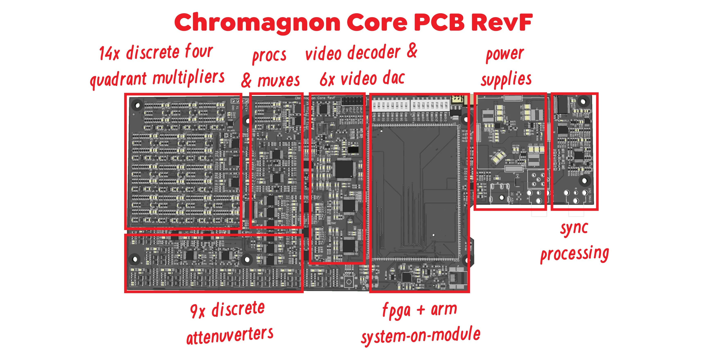

It's the last Saturday of 2023, and it's been a busy week.  With some LZX teammates out of town and under the weather, I've done my best to mind the shop and ship your orders.  

<!-- truncate -->

Earlier today, I hit the milestone I mentioned a couple of posts back -- releasing CAD files for the sixth revision of the Chromagnon core assembly, and I'm very pleased by how it's taken shape.  I've put about 150 hours into this board since the beginning of December, including PCB layout, schematic drafting, parts research and a few SPICE simulations.  Even though it inherits from earlier revisions of the circuit, this board combines what was previously 3x separate PCB assemblies -- so it's more like a redesign than a revision of the layout.  It is without a doubt the largest and most complex board we've done at LZX to date. 

So what's next?!  This board will take 7-9 days to manufacture (starting after the holiday) at our PCB fabrication vendor, and then 3-4 days to ship.  That means it will land in the third week of 2024.  In the meantime I will be writing test and verification plans for reviewing the assembly, and making adjustments to the firmware.  The production crew will begin importing the list of parts into our manufacturing resource planning system and preparing programming files for our surface mount assembly machine -- and also placing orders for any parts we may need. 

That all may sound like a lot, but it's the kind of work we're used to around here.    If everything goes smoothly, we'll be turning it on for the first time around January 20th. 

In addition to work on this assembly, I've also been tuning some new systems and processes to go into effect in the new year -- task planning boards & schedules, design templates, social media calendars -- all of which I hope will enable us to juggle a wider variety of tasks across the company, and keep our sales strong -- something that will be necessary to deliver Chromagnon as soon as possible. 

I'll break some of those plans down for you in the next posts, and also want to take the time to describe the concept and inception of the Chromagnon instrument, and what I hope it accomplishes for video artists.

So far, none of you have written in questions or comments.  I've created a form to make that easier, located here: https://wkf.ms/47lhPPA.  Let me know what's on your mind.

Yours, 
Lars