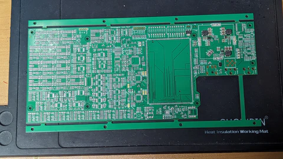
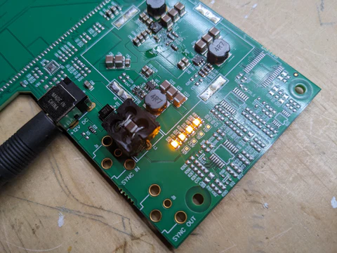
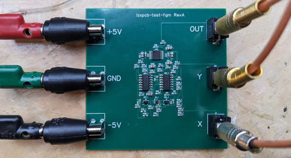

Howdy Chromagnon-folk. It's Friday and the week has been productive at LZX HQ. We're expecting snow over this upcoming holiday weekend here in southeast Portland.

<!-- truncate -->

The best news of the week was the early arrival of our Chromagnon Core PCB's latest revision, as well as a test board for its four quadrant multiplier sub-circuit. After scrambling to get a few parts here faster than we expected we'd need them, we began assembly and testing on Wednesday. I was planning to talk about the Chromagnon conceptually this week, but since we reached this early milestone we'll save that topic for the future -- instead let's dig into the hardware itself.

Now begins the long list of tests and measurements involved in verification, the process of making sure every aspect of the new circuit board revision is performing according to Chromagnon's design requirements. Verification of this massive 1300+ placement assembly will take 10-15 work days, and we can hope to be done in early February.

 

*Chromagnon Core RevF power supply testing assembly*

The verification process is divided into a few phases: unit testing, regression testing, and integration testing. Unit testing will verify the performance of new features -- in this case the entire digital subsystem and power supplies were moved onto the PCB on this revision, and all of them need to be checked. Regression testing will verify that everything working on the last revision is still working.  Integration testing will verify that the core PCB operates as expected when combined with the control PCB's user interface and firmware.

To test the power supplies I asked our SMT assembly technician Andrew to build a variant of the big board with only the power entry and primary power supply components installed. This means that we have removed all of the liabilities from the test that may interfere with power supply performance for issues unrelated to the power supply circuit itself.

   

*All power rail indicator LEDs are go!*

To perform these tests I used our Fluke 115 multimeter and Rigol MSO5074 Oscilloscope. After discovering one issue with a missed schematic connection, and altering a few resistor values, the power supplies are fully verified. I'll come back to this assembly in a few days when I get into performance testing, so that I can see how the power supply's noise floor is effected under load.

*Four quadrant multiplier board under test*

The next tests involved the four quadrant multiplier test board. This is such a key circuit in Chromagnon's design, that I knew from experience it would solve problems to have it on an isolated test board. Like the power supply assembly, I may come back to this board later on in the verification process if I need a baseline established between how the circuit performs in isolation vs how it performs with all the other parts on the combined assembly.

Next week I'll share our continuing progress with verification of the Chromagnon Core PCB. Hans (our SMT machine) is busy on the full assembly as I write this.

Here are a few more questions you asked after the last post.

**Jim asked "[Is there] a risk that if sales of non Chromagnon modules slows down that customers might not receive their Chromagnon pre-orders?"**

Slowing sales may slow Chromagnon's production process or the speed at which orders are shipped, but it does not imply there is a risk you won't receive your order. Shipping all Chromagnon orders is our foremost priority.

**Paul asked "The future looks very bright for Chromagnon, will LZX in the future move towards basic 3D shape animation, maybe modules that can replicate PC graphics from 80s-90s?"**

I think adding more 3D controls will be probable with the upcoming revision to our flagship digital video synthesizer, Memory Palace. I would love to be able to map video inputs to the sides of a spinning cube, or other Amiga demo scene era figures.

**Garrett asked "Hey Lars, any chance the roadmap will updated for the post Chromagnon era? Definitely a fan of hearing more about module concepts or design/features to expand the modular series."**

In the modular arena, we are prototyping some new options in the IO module categories. We also plan to release a large rotation/affine matrix module in the wake of Chromagnon's release. There's always a list of hundreds of module ideas around here -- but the times in which we have got ahead of ourselves, we've regretted it. So we're staying fairly tight lipped on future project details right now. This year will mostly focus on more user resources, manuals, documentation and video tutorials for the existing modular series -- and of course, our most ambitious module yet: Chromagnon!

**Pat asked "Do you know when sensory translator will be back in stock? Or do you have plans to make a new model of it?"**

We don't have an audio envelope on deck at the moment, but definitely check out Aural Scan by VH.S. It is a new triple channel audio envelope released in 2023.

Until next time,

Lars