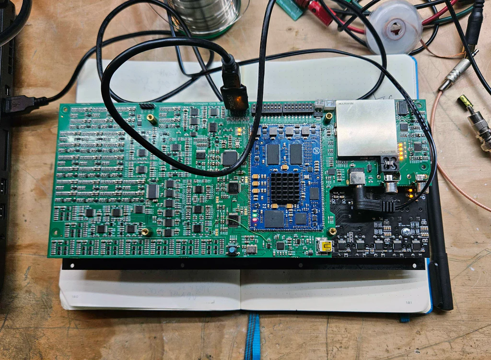

Hello Chromagnonfolk,

We had a busy week here, catching up on activities after being iced in last week. I spent most of the week reviewing the Chromagnon Core PCB RevF, and am relieved to report the assembly has passed everything in the 42-step test plan I mentioned in the last blog post.

<!-- truncate -->

The full assembly is looking much slimmer now, with this new board -- something that will allow Chromagnon to easily fit in more EuroRack cases. Power consumption is sitting just under 1.5 Amps on +12V input, so we recommend using it with the included 12V DC adapter.

Next week I hope to show off some more videos of Chromagnon's output and transition to working on other pre-production deliverables -- such as working with our contractor to make a mold for Chromagnon's enclosure and control knobs.

**Carl asked for clarification about Memory Palace Mk1 and the upcoming Memory Palace Mk2 feature sets in regards to SD and HD video formats.**

Memory Palace Mk1 will support SD modes only.

Memory Palace Mk2 will support SD and HD modes.

**Tristan said in reference to Chromagnon: "I'm new to video synthesis so I want to know what it will be capable of... but there are (to the best of my knowledge) no demo videos out there."**

We will be recording demo content of Chromagnon very soon.

**RobG asked about screen saver features for Memory Palace & TBC2, 240p60 support for TBC2, and black frontpanels for Expedition series modules.**

You'll be happy to know that a firmware update was released for TBC2 with the screen saver a few months ago. You can get it on the TBC2 page of our website. Additionally, you can find black Expedition Series front panels for sale on the site. 240p60 support is coming in the next version of TBC2's firmware, we have it working nicely with an SNES console. We will add screen saver support for Memory Palace Mk1 on it's next update as well. Both of those updates will come this year, following Chromagnon's launch.

**Leslie said "Not a question but a statement: Keep the content coming from Andrew Dobbels. The 'Dobbels Demos Ribbons' video on YouTube is some of the best teaching of concepts and patching I've ever seen coming out from LZX. Its thorough, specific, and paced to allow for easy patch along at home."**

Thanks Leslie! There are more Dobbels videos in the works, and be sure to catch his live stream on the LZX Twitch channel every Wednesday at 7PM PST. For those of you who missed it, check it out here: https://www.youtube.com/watch?v=maxfR128_Ec

Until next time,

Lars