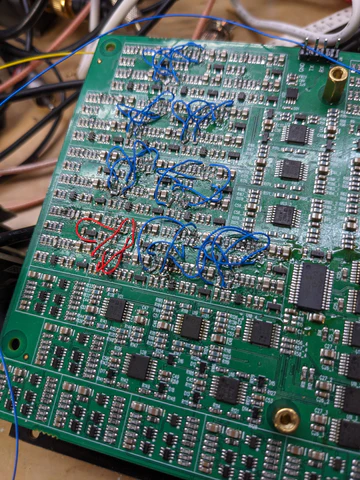
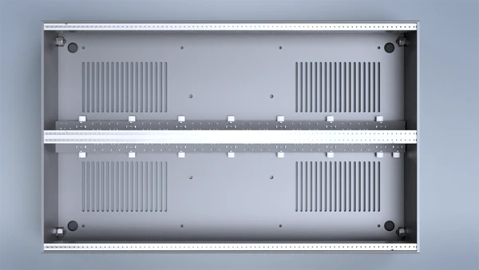

Hello, Chromagnonites.

It's been another productive week validating the Chromagnon Core assembly. The video output is looking good (see below), but it required some complex rework to get there.  

<!-- truncate -->

<iframe width="560" height="315" src="https://www.youtube.com/embed/2BtI9M7gCUQ?si=p-4W_r79W66yeHUn" title="YouTube video player" frameborder="0" allow="accelerometer; autoplay; clipboard-write; encrypted-media; gyroscope; picture-in-picture; web-share" referrerpolicy="strict-origin-when-cross-origin" allowfullscreen></iframe>

*Crossed wires*

There are only a couple more validation steps left. For next week I hope that testing is complete and that the core board is revised and ready for production. From that point, we can move into preparing the injection mold order for the enclosure and designing a rear finishing panel, which will include legending for Chromagnon's rear connectors and switches.

This week we also finished preparing CAD files for another one of this quarter's projects, which is a prototype EuroRack case design and power busboard.  Here's a render of the work in progress.

Now onto your questions…

**Mario asked, "The big question is are there going to be preorders soon? Are you going to send some to Schneidersladen or Raw Voltage?**

You can place a preorder at any time, either with us or the retailer of your choice.  Both of the retailers you mention have Chromagnon on preorder, but we can't speak to the availability of what they've reserved with us; please reach out to them directly.  We will be shipping in the sequence that we received Chromagnon preorders, regardless of whether the customer was a retailer or an individual.

**Michael asked, "I am just getting into video synthesis and I’m thinking about getting a Chromagnon once it’s released because it seems like a solid one-stop centerpiece for any rig. My intention is to fill up a 104hp skiff I already have, if only for the sake of putting any other money towards more modules rather than another skiff. What other modules would you recommend to fill out that space? My primary interests are pattern generation and manipulation, and responsiveness to audio; I’m less concerned with processing external video."**

Filling a 104HP skiff with Chromagnon and other LZX modules is a great plan!  Chromagnon is exciting on its own, but you will get more out of it if you have a variety of external modulation sources. 

I would recommend DWO3 (Dual Oscillator), DSG3 (Dual Shape Generator) and Scrolls (Dual Animation/Scrolling Plane Generator.)  Chromagnon is very rotary in it's internal animation capabilities -- making two things spin, for example, or making a plane spin within another spinning plane. Scrolls' linear movement (which is like a camera pan or wrapping background) will complement that nicely.  DWO3 and DSG3 will make more complex pattern generation possible, and provide different image processing capabilities as well.

**Michael also said, "I was just looking through the Chromagnon updates and saw you mention that you’re in SE Portland"**

If you haven't connected with them yet, check out the Portland Synth Library and the PDX Video Mixer events!

Got more questions? Ask ‘em here: https://wkf.ms/47lhPPA

Before I go, I want to mention that we now have two different weekly live streams on our Twitch channel.

Day One hosted by Nick, every Monday at 10AM PST

Dobbelstream hosted by Andrew, every Wednesday at 7PM PST

Nick & Andrew, in addition to their manufacturing duties in the workshop, are accomplished video synthesists. Each stream they walk you through improvised patches demonstrating their own techniques. 

Until next time,
Lars