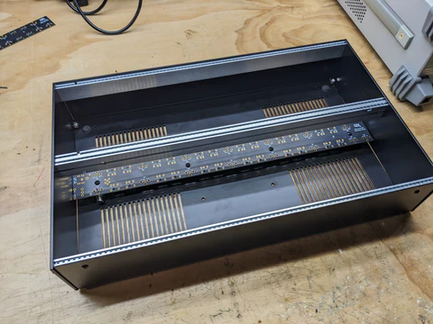
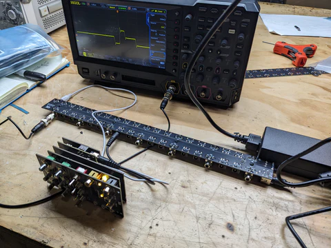

Hello everyone,

I apologize that we missed last week's update.  I was dealing with family visiting from out of state, a dental emergency, and a busy week of high school musical performances (my child Kat was in a production of Grease.) We did meet several goals however --

<!-- truncate -->

- Chromagnon Core RevG revisions were completed, and boards have been ordered.  While we still need to validate that the revisions are good to go (a first article test) before production, this means design of Chromagnon's electronics is finally complete, and I can move on to details related to the enclosure and control knob mold -- as well as polishing the firmware and making more docs and videos for you.
- Prototype pieces for our new EuroRack enclosure arrived, and we had some successful testing of our new DC Power & Sync distribution busboard. Unfortunately one of the case pieces arrived from the fabricator warped -- they've refunded us but that's why you can see some gaps and imperfections in the below photo.  Everything else looks good though and we'll be ordering a small quantity of cases for production this month.

**Derek asked "When will LZX hire a full time firmware coder? Lars you are one person, and you can only do so much while so many wait for overdue firmware revisions while you are stretched thin over so many projects. Learning how to let go, and delegate this important task seems very important from a customer and getting important tasks done point of view. On a related note, will there be a firmware update to fix the vertical seams in the mirror modes of Scrolls? I want clean mirrors without a big line in them. Is this a result of using a 1080 timing and the device being calibrated to SD timings or something else?"**

Thanks for the concern Derek -- unfortunately we do not have the resources to hire anyone else with those skillsets right now.  While managing product development personally is important to me, delegating firmware tasks is something I would have no trouble doing if resources allowed. Firmware projects have been backlogged for years due to the extended development time required by both TBC2 and Chromagnon.  While that journey has been much longer than I thought it would be, it's not a permanent situation -- it's just a lengthy one, and one that is nearing its end. With those projects in the past, it will be much easier to provide timely updates.

You'll be happy to know we have solved the issue in question regarding mirror mode in Scrolls causing a blank pixel or two at the peak of the waveform while in HD modes.  Unfortunately this is not a user serviceable firmware update, as it applies only to the FPGA waveform generator portion of Scrolls and not it's microcontroller. If you would like to have the fix applied to your unit, contact us to arrange an RMA at support@lzxindustries.net.

**Nathan asked "Awesome to see a new case design from you guys! Any chance we'll see a 104hp version? Sync daisychaining between cases like vessel? Maybe a separately sold power supply/busboard?"**

Hi Nathan -- it's great to hear you're excited about Vessel Mk2!   Right now we plan to release a single size boat, which is 6U and 2x84HP total.  The goal is to meet as many user requirements as possible initially, and the priorities there are that it's 19" rack mountable and deep enough to fit all prior generations of LZX modules.   A 2x104HP variation would be easy to implement if we keep getting requests for it, but we want to successfully launch the 2x84HP version first.  There will indeed be a separately sold power supply/busboard -- two in fact, one for DC power & sync distribution, and another traditional EuroRack power supply inheriting from our low noise Capsule Power design.

**Chichi asked "What kind of functionality will the ILDA inputs and outputs [on Chromagnon] have??"**

Hi Chichi -- the ILDA IO is very interesting to me personally, because it is a feature that fully embraces the design concept of Chromagnon as a processing instrument which spans multiple dimensions. At the heart of Chromagnon is a massive analog vector processor -- the algebraic functions inside take voltages representing 2D coordinates and transform them through user controls and high frequency voltage control. These 2D transformations such as size, position, rotation, and skew can be applied universally to any XY voltages! In Chromagnon's case, the front and  of the instrument offers four primary ways to source the initial signals: horizontal & vertical video ramp waveform generators, the UV chroma colorspace of a video input, the XY coordinates of an ILDA input (like the Neon Captain Radiator), or the UV chroma colorspace of an ILDA input.  So put more simply, Chromagnon can be used as an analog post processor for your laser visuals -- if your ILDA generator is creating a star shaped pattern, Chromagnon could be used, for example, to rotate, warp, resize, or animate that pattern.

**Michael asked "Hey Lars, I just placed a preorder for the Chromagnon and I was wondering two things…First off, if I were to put together a 104hp skiff to complement it, are there any modules that having Chromagnon de-necessitates having? I know you recommended the DWO & DSG to pad it out, but are there any modules that I specifically *wouldn’t* need because they’re redundant? Or does Chromagnon only cover functions not covered by other modules?"**

There are two approaches to using Chromagnon along with LZX modular.  

1) Using it as a big module inside your modular system.  In this case, your primary inputs and outputs are from decoder and encoder modules like TBC2 & ESG3, and the output of Chromagnon is taken from it's XY + RGB outputs instead of it's video outputs. In this case, there aren't any redundancies. Chromagnon becomes LZX's "complex vector processor" in the modular sense. 

2) Using it as your core instrument, with other modules as expanders.  In this case, your primary video input and output are Chromagnon itself, and other modules are introduced simply to expand the existing workflow. For example, DWO3 could be added to add more modulation and pattern sources.  So the redundant modules in this use case would be TBC2 and ESG3 (those focusing on external video inputs and outputs.)  All of the other modules can find a place in your "Chromagnon expander" workflow. 

**Michael also asked, "I’m wondering if you have an ETA for the Vessel cases, and if you might have a recommendation (or recommendations to steer clear) for other eurorack cases out there. I was thinking about a Doepfer A-100 (6U/84HP), but the forums seem to be a little conflicting as to whether that’s ideal."**

Any EuroRack case is a good candidate, but we do recommend that even if you have a powered case, that you install our DC Distro module to supply power to Gen3 LZX modules via their 12V barrel connectors.  Otherwise the video modules will quickly exhaust a typical EuroRack power supply's current limit. 

**Michael also asked, "Are you planning any new or different version of the Sensory Translator? Or else can you recommend the most flexible options for audio reactivity? That would be my priority in selecting anything to go with the Chromagnonen."**

Yes, I am planning to release a new audio-visualization tools module in the Gen3 lineup, but it is not an active project right now.  I recommend Aural Scan by VH.S as a great envelope follower / audio-visualization accompaniment for Chromagnon. Other envelope followers in the audio EuroRack world can work well for this use too, but Aural Scan is specifically scaled to LZX voltage range, and includes a video rate crossfading/scanning function.  Also, any of Chromagnon's parameters can be directly modulated by audio signals without requiring any sort of interface at all.

Until next time,
Lars