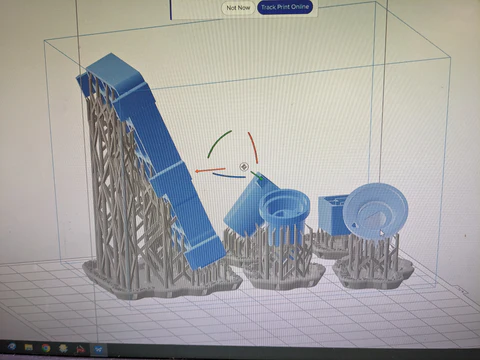
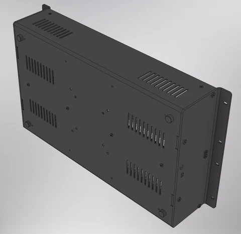

Hello, video pals!

We are pushing through April! The current primary focus is on preparing our resource planning system for Chromagnon and smoothly flowing the production of our other projects.

<!-- truncate -->

Here are some photos of our inventory workspaces. We have accounted for hundreds of unique bin locations and over two million parts over the past few weeks. This primes our resource planning software to identify the quickest path solutions to keeping our manufacturing lean and effective with our small team.

Last week I printed revisions of the Chromagnon molded parts for test fit on our Formlabs printer, which is usually a joy to work with, but required some maintenance this time around. I've been verifying test fits and getting quotes for various fabrication methods.

Among other recent projects is a Mk2 revision of our TBC2 expander panel.  We lost our source for the SCART connectors used on the Mk1, 10HP version of this expander, so it has been revised to be 4HP with VGA connectors only. Those of you still waiting on your preorder of this module, or waiting for the firmware revision including all the VGA timing modes, will be served soon. Once we confirm the incoming design, we'll make it available for purchase.

We also ordered an initial production run of 10 pcs our 6U EuroRack case with DC & sync distribution. If the fabricated pieces pass our QC, we should have these available for sale in May. I've shown some teasers of the prototype before.  Here's what the production version looks like:

Today I am designing the Chromagnon rear panel and making revisions to the injection molded enclosure design. With those last pieces on order, my plate will be clear to focus on the Chromagnon firmware release and documentation.  

The changes in team composition I mentioned last update have slowed down our overall schedule with Chromagnon by another few weeks, compared to my plan to be shipping the first unit this month. There was, sadly, not much I could do about that, but the lag time is behind us now, and adjustments to our plans have been made. 

Dave, the designer responsible for the Expedition, Castle and Orion series patch and sticker designs is working on a Chromagnon design currently! I look forward to showing that to you soon. We will, of course, be including this additional merch in all Chromagnon shipments.

Other news: There has been a restock of merch items, cables, and alternate frontpanels on our webstore. Go check it out!

Here are your questions since the last update:

** Paul asked "Is it likely Chromagnon will ship this year?" **

The goal we are fixated on right now is "Ship Unit #1."  And we're within a few weeks of that goal. Will we be done fulfilling all orders by the end of the year?  I hope so, but that is the larger question.  After shipping the first unit we'll be fulfilling in batches that start small and then ramp up.  By the time we are shipping the first unit, everyone will know very specifically their spot in the batch allotments and a projected fulfillment date.  

**On the forum, Boneoh asked "Is there something I can do to clamp the bright areas that allows adjustment? I can use Proc to decrease the brightness, but that scales the whole range down. It sounds simple, and I think I’m missing something. Maybe a way using the Y value in Swatch?"**

It sounds like you want to adjust the gain of the brighter parts of the signal only, without effecting the darker or midtone values.  This kind of signal processing involves a non-linear transfer function of some kind.  There are several ways to approach it. 

One way would be gamma curve adjustment using the logarithmic and exponential processors in DSG3.  By feeding luma video thru these processors you can compress the dark values (exponential curve) or you can compress the light values (logarithmic curve.)  Try this, and then mix the results with the original signal at varying proportions to dial it in the way you want.

Another approach would be to use multiplexing (Switcher) and a comparator (Keychain) to change between two different processed signals, based on the grayscale level of the unprocessed source.

Until next time; please keep your excellent questions coming!
Lars