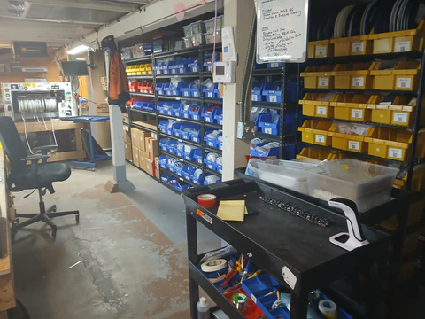
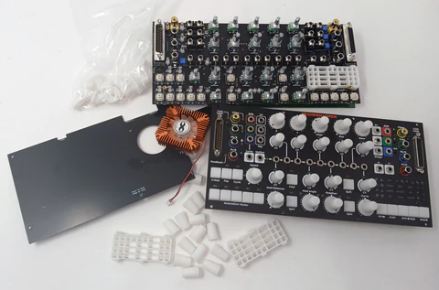
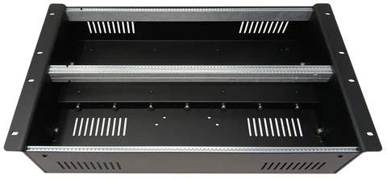
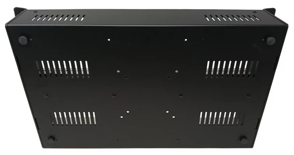
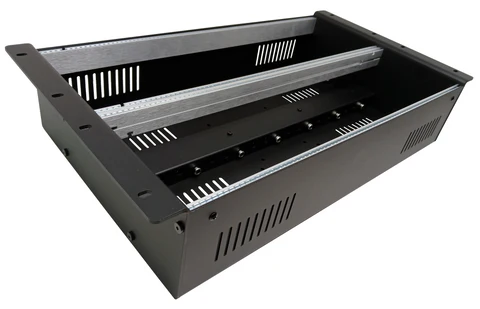

Wow! April flew past, here at LZX HQ. Our improvements to operations and inventory have allowed us to process a large number of tasks in the ongoing effort to keep modules and stock while taking steady steps towards Chromagnon's launch. 

<!-- truncate -->

A well organized inventory and resource planning system allows our small team to manage a large number of products and more accurately estimate production dates.

Since my last post, there have been two iterations of Chromagnon plastic parts, and I am waiting on a third batch in black to arrive. I am very happy with the fit and look of these components and feel like they add a lot to Chromagnon's personality. 

Also arriving since my last post is Chromagnon's back panel PCB, which is where Chromagnon's cooling fan will mount.  I have a few adjustments to make on this part, but otherwise it looks nice.  The only remaining part of the assembly is the enclosure/shell piece -- I should be able to show that to you soon.  With all of those designs sealed, we will finally have the complete recipe card for this prehistoric video synthesizer. 

Additionally, on the Chromagnon front, I have been reviewing our inventory of Chromagnon control assemblies. We have several hundred of these built, but they need functional testing. So we built a test wiring harness and embedded system to speed up that process.

In modular news, we received our production parts for the new case, now officially titled Vessel 168.  I'm so excited about how good the matte black powder coating looks on the sheet metal, and on the fit of all the components.  We'll have an initial batch of these up for sale in a few days. This initial offering is rack mountable, and includes a central DC & Sync distribution bus, with 28 DC power jack outputs and 14 buffered sync outputs (with a single sync input).

Coming next for the case will be variants for 3U, the much requested briefcase version with lid and carrying handle, and a EuroRack power supply expander for powering your legacy modules.  Please let us know if you have any suggestions on what products you'd like to see in our catalog for case and case expander variations.

In TBC2 news, after much research and testing, we have made an ultra silent fan upgrade kit with installation instructions for the Gen3 (Mk2) and are currently making a similar kit for the Orion (Mk1) units.  Once we have both of those in stock, we'll have them available on the website. The fans in use on TBC2 have had a variable range of loudness, with some fans being annoying to some users.  The fans we used were initially designed for 3D printers, where noise is not a big concern -- so it's taken us a while to find fans in the right form factor which are also dead silent.  Also, the TBC2 Expander Mk2 I previewed in the last blog has been prototyped and looks great, so we are in the middle of building a batch.

Now, on to your questions:

**Pat asked "Are you really a few weeks away from shipping the first Chromagnon unit? How many weeks if you had to guess?"**

A better way to phrase that statement would have been "we are about 2 months behind the schedule we made back in December when the blog started." That schedule was looking to ship a first unit in April, so that would mean I am now hoping to be doing so by the end of June.  It's looking good that all the production related deliverables will get wrapped up this month (the final enclosure design is the biggest piece missing).  How fast we roll out production from that point, is still unknown -- but we are making steady forward progress.

**Michael asked "Do you know when the Proc might be reproduced? I have an order for it with Perfect Circuit but I don’t know if I should wait on that or, if it’s going to be on the other side of the Chromagnon stuff, just try and find one / something else on the used market. "**

We have Proc in stock here at LZX -- if Perfect Circuit don't have stock, they can place an order with us at any time.  It could be that they recently received a shipment from us, but have not put it into inventory yet.

**heavy light asked "I realise the team  are busy building /designing modules and all that but when are we getting some new t shirts ?"**

My comrade, there is a new shirt / patch / sticker design for Chromagnon in progress right now.  Dave, who designed the Vidiot & Chromagnon characters is working on it. Please always let us know if you have suggestions for what merch or merch designs you want to see.  We love showing our personalities as designers in ways that extend beyond the products themselves. Since we were all in many bands at various points, merch is a big part of that!

**Aaron asked "Hi! I want to update my shipping address before you start sending out units; how can I do that?"**

You can update the shipping address for your order at any time by writing to sales@lzxindustries.net.  But don't worry -- we'll be reaching out to each and every customer individually before your shipment goes out, to confirm the details.  We don't want any Chromagnons lost in the mail!

The biweekly schedule has been working well for the blog, so I will be sticking with that moving forward.  I'm likely to issue more updates once we're past production/development goals and into a more promotional phase.

In totally unrelated news, I will be playing wargames at the fourth 3D Roleplay Con here in Portland over the weekend.  Please wish me many victories.

Until next time I remain faithfully yours,
Lars