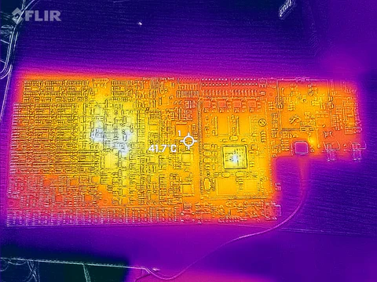
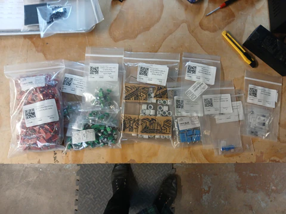
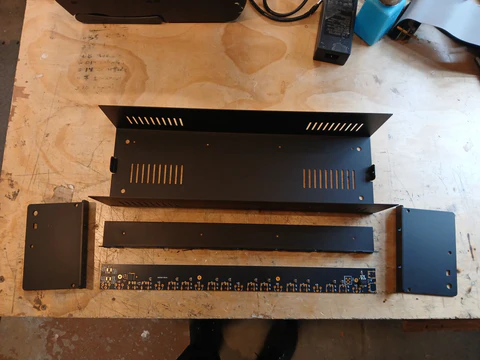

Dear video friends, 

June has seen a lot of projects landing at the workshop and some significant pushes in firmware development. Over the Spring we have transitioned into outsourcing SMT assembly of our modules in smaller batches, in an effort to keep things stocked and flowing, and those efforts are running smoothly. 

<!-- truncate -->

The Summer is traditionally a period of low sales for us, so we have decided to open a sale for some modules we have lots of stock of. You will find Contour, Matte, and Sum/Dist have been marked down 25%, for the time being, on our webstore. If you've been wanting to pick one of these up, now is a good time to do so.

Here is a summary of notable recent milestones:

TBC2 1.0.3 firmware was released.  This includes better support for the VGA input expander and the addition of a 240p input mode.  So pull out your SNES and Chrono Trigger cartridge if you want to travel thru time, saving the world from Lavos, while also traveling thru your analog video circuits.

If you had an outstanding order for the TBC2 VGA input expander module, it has been shipped.

We are now stocking fan upgrade kits for TBC2 Mk1 & Mk2 on our webstore.  If you already ordered the Mk1 (Orion style) kits from us, we neglected to send mounting screws in the first few shipments -- but the screws have already been mailed to you in a separate package this week.  So look out for that.

Memory Palace 2.0.2 firmware was released.  This is a maintenance release which includes a screensaver function to prevent burn-in on your OLED screen in the case that you are logging lots of hours on your device. 

TBC2's video engine firmware has been ported to Chromagnon and is running on the new RevG PCB assembly.  I've put a lot of time into merging work from TBC2 into a common library that is now shared with Chromagnon, to ensure consistent performance across both devices.  This will also set the stage for Memory Palace Mk2 revisions, which will be the big project after Chromagnon development has wrapped.

This past week I have written a parameter state engine, with auto recovery from loss of power or corrupted backups, to use across our firmware for various modules.  This will ensure that Chromagnon boots back up in the same state in which it was powered down. We'll be able to integrate that functionality into the next firmware release for TBC2 as well. 

Entering July, I am still investing most of my time into Chromagnon firmware and hardware review.  This includes writing tests for validating the control assemblies we've already built and the RevG hardware.  Currently I am improving the software that allows for firmware update from MicroSD card, since with Chromagnon it needs to run in a headless manner. (Unlike TBC2 and Memory Palace, which both used OLED screens and keypads.) 

*Chromagnon RevG under the thermal camera!*

A few background projects landed in June as well, including some parts we will use to revise the Cadet DIY series.  This maintenance revision will be ongoing for a few months, and will bring the core DIY modules up to spec for HD video synthesis timing, and offer some new supply chain/build options for hard to source components.  Once these revisions are complete, we'll offer the PCB and frontpanel sets again via our webstore.

Our order from Thonk for parts to use in building Cadet revisions.

In our ongoing initiative to offer a line of professional enclosures for our modules, the pieces for a 3U variant of our 6U rackmount case have arrived.  These will be an upgrade option for your Double Vision system, and we'll soon offer a version of the Double Vision system which uses this case.  

3U variant of our powered EuroRack case for video synthesizers

Additionally, a kit variant of our 10 amp DC power and sync distribution bus has arrived, for DIY installations into other cases. This version includes a chassis-mounted DC input jack and screw terminals on the PCB.  The busboard is equivalent to three times the amount of power and number of connectors as our 4HP DC distro module, and it will be suitable for powering cases of Gen3 modules over 252HP.   Look for this on our webstore in July.

Next case projects will include a portable variant with a lid, and a legacy power supply expander for the 6U and portable cases.  The legacy power supply expander will be perfect for powering audio modules or older generations of LZX modules using the new Vessel cases.  I'm excited to have a case that works with everything.

**Pat asked "The prototypes for the plastic pieces and enclosure look great! I’m stoked that you guys have come this far with the project!. A few weeks ago you said you are hoping to ship unit one in June, is that still the plan?"**

Hi, Pat. Thanks!! We are getting close to that point. The Summer slump I mentioned slowed us down slightly -- and I squeezed in the TBC2 and Memory Palace updates that folks have been waiting on for a while, which delayed us as well. With the firmware project above wrapped up, we will be close to shipping the first unit.  Then we can roll up our sleeves and get our headspace shifted into rolling into a rhythm with the remaining Chromagnon production, documentation, and fulfillment.

**Yuya said "Thank you so much to Lars and all of you who continue to work hard every day towards the launch of Chromagnon! I love Memory Palace. Luckily my Memory Palace display hasn't burned in yet, but I'm super nervous about it happening... Are there plans to release a new firmware that implements a screensaver like TBC2? Also, are there any plans to release a fan upgrade kit like TBC2? Thank you again!"**

Hello, Yuya. Thank you so much for your enthusiasm and support.  It is a relief on my stress levels and a boon to the projects we are working on to hear from you all like this.  As you can read above, the Memory Palace firmware update should help with your concerns about screen burn in.  I will definitely add a fan upgrade kit for Memory Palace to our project queue, now that TBC2 kits are out the door. 

Got more questions, suggestions, comments or high fives? Go for it here: https://wkf.ms/47lhPPA

I am curious what user documentation projects you would like to see us tackle before the end of the year.  I want to know what would add the most value to your experience with LZX modules you already have. So if you have suggestions, please write to us.

Thanks for tuning in,
Lars