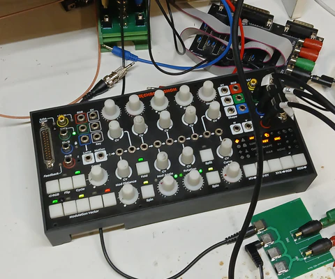
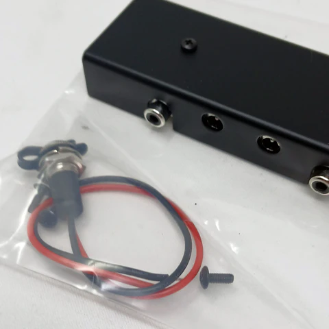

Over the past several weeks I have been writing Chromagnon’s firmware, and I’m happy to say that I now have a complete version ready for testing.  I wanted to reach this milestone before I wrote a new blog, as it represents my exit from the Code Cave and back into the workshop.  So let my eyeballs readjust – this blog will mostly be about the software.

<!-- truncate -->

*My trusty Chromagnon RevG development unit, back at the test bench*

From Memory Palace and TBC2 to Chromagnon, I have needed to double down on my embedded software skills. Approaching these instruments, I had many firmware and software projects behind me – but none at this level of structural complexity.  So I was surprised by the scale of what I still needed to learn with regards to architectural patterns and systems level design. Hardware scales easily – five circuits is five circuits – but in software, writing a state control system for five asynchronous modules is a different beast entirely.  The experience has definitely kindled a love for embedded development with modern C++ in general, and I look forward to doing more of it. During the past few weeks of getting cozy with Chromagnon’s digital brain, I felt both confident and effective, and that was a relief.

What’s next? With firmware in place, we are able to move into a new verification process for the instrument as a whole.  That’s a long list of tests, including nearly 200 different video input conversion modes – in addition to all combinations of Chromagnon’s 12 compositor modes, 3 chroma modes, 3 luma modes, and 4 primary modes. Most of this testing has already been done with prior versions of the hardware, but we still need to repeat the tests now that we have a firmware candidate. In the next blog, I’ll describe how that’s going.

In other news, we have added the DIY kit version of our power & sync distribution busboard to the webstore.  Check that out here.

We also have a restock of Scrolls hitting the shelf. While I have not had time to film it yet, here is a script for a video about Scrolls that you may read. 

Our Summer sale is active, with discounts offered on Sum/Dist, Contour and Matte modules. 

We're still taking orders for Double Vision systems. It has been exciting to watch new video artists dig into the depths of their systems over the Summer.

Here are your questions, since the last post.

**Luis asked, "Are there any plans to further improve the Memory Palace firmware?"**

Memory Palace Mk2 will be a follow-up project after Chromagnon. The first phase of that project will include some revisions to the existing Mk1 firmware, as our plan is to support concurrent versions. The main difference being that Mk2 will support HD modes. 

**Mat asked, "Just curious about the timeframe in regards to the Double Vision preorder. Will there be a long wait? I just ordered recently and will hopefully not have to wait as long as I have for the Chromagnon."**

Since we launched the Double Vision system bundle, the average wait time for a shipment has been about 3 weeks.  I expect that to stay consistent.  We have a good flow coming thru the workshop of stocking the module sets in small batches. Your Double Vision is actually in QC today, and planning to ship tomorrow.  You sent in this question on July 15th, so that seems pretty consistent with the average lead time.

**Thomas asked, "Are preorders for the Chromagnon still open? Nothing happens when I press the preorder button, and I see people selling their preorder slots online.  Am I too late to buy one?"**

Preorders are open. If you click the preorder button on the product page, you should see it added to your shopping cart (but the site doesn't automatically take you there.)  This is not a limited edition -- the date we have Chromagnons in stock and all preorders are fulfilled is still uncertain, but you don't need to worry about missing out.  We hope to keep the instrument in production for many years.

**Patrick said, "It seems like a lot is happening over there right now, and there are many updates and things to discuss in each monthly journal post. Is there any inclination to get back to doing a weekly journal post to keep us more in the loop? Or would that slow production down because it's another thing to think about? Either way, I'm glad Chromagnon is still being worked on. Since June has come and gone, is there any new estimate for when the first unit might ship out?"**

Patrick, I'm sorry the updates have been less frequent.  Currently the core team is down to myself full time and three part timers.  Writing these blog posts is no huge burden, but it does take 2-3 hours out of my work week each time. With hardware development and workshop projects, tasks are shorter -- 1 to 16 hrs each -- to do a board layout, or revision, or build a prototype.  With software or circuit design it's often 3-6 week sprints, during which it can be difficult for me to do anything but write code or run simulations.  With code sprints in the rear window for now, I'll try to up the pace of the updates.  I'm hoping to be past hardware verification and on to production and user docs soon.

**Kazys asked, "How effective is Chromagnon with a Vectrex? Can it do Rutt-Etra style rescanning into X / Y / Z out of the box?"**

We have not recorded any Vectrex monitor tests yet, and that should be the final judge of this -- but you've got the right idea. The scaler decimation settings allow you to output low frequency rasters for lower bandwidth displays, like laser projectors and the Vectrex. I expect some of the middle settings to be right for use with the Vectrex -- a raster size of 120x68, for example.

**Kazys also asked, "If I have a Chromagnon, why would I need an ESG3? Is it still useful?"**

Definitely. Chromagnon has no dedicated RGB level or offset controls, so ESG3 would add a lot, with each of ESG3's six knobs and three switches representing parameters not present on Chromagnon.  Another reason to have an ESG3 is if you are using Chromagnon in the context of a modular system, and want to mix it's output with other sources before the final output. 

If you have questions about hardware development, software development, LZX, or you just need someone to talk to, write to me here:  https://wkf.ms/47lhPPA

- Lars
