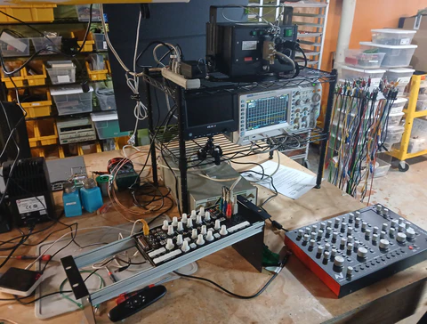

I hope everyone has enjoyed their Summers and is looking forward to the Fall.  For me, this time of year has always meant getting ready to learn, whether that was in my prior career in e-learning development, with my kids starting the next grade, or in my own educational goals. This year it will mean entering a period of content creation for LZX-- documentation, videos, tutorials, and any other resources that serve your own learning and creative pursuits in making video art.  

<!-- truncate -->

Last week we reached a couple of big Chromagnon milestones: The RevG Core hardware has been fully reviewed; slow scan raster generation for ILDA laser and low-bandwidth displays has been implemented; and we have a complete synthesizer on the workbench -- finally!  Unlike software based visual generators, or simpler analog circuits (like our modules), Chromagnon is a design that has been very difficult to show as a work in progress until all of the pieces, both hardware and firmware, were in play.  I am very glad to be at this point, because you'll no longer have to take my word for it when it comes to what, how, and why Chromagnon does what it does.

<iframe width="560" height="315" src="https://www.youtube.com/embed/vhlNyixE1vo?si=Vl5htKHzqpl1NEQK" title="YouTube video player" frameborder="0" allow="accelerometer; autoplay; clipboard-write; encrypted-media; gyroscope; picture-in-picture; web-share" referrerpolicy="strict-origin-when-cross-origin" allowfullscreen></iframe>

Testing in progress.  Excuse the clutter!

I'll be recording more in September, including a walk through of Chromagnon's user interface and functions, as we continue checking off items on our test list and working towards finalization of the design for production.

Since our last update, we have one new user question. 

** Pete said "Hi, Lars! Glad to hear your progress update, it must feel pretty good to get out of the cave and into the light!  I'm curious as to what h/w you have chosen for the Chromagnon. I'm interested in FPGAs and have ordered a Zybo board to experiment with." **

Pete, thanks for writing!  Chromagnon's hardware is quite intensive.  At it's core, it is an analog synthesizer with a fully analog, wideband signal path -- but also, there is a complex digital embedded system which handles the user interface, video input decoding and scaling (SD to HD and HD to SD), and 10-bit ramp waveform generation. 

For the digital system, we are using a System-on-Module from MYiR, which you can read more about here. This is based on the Xilinx Zynq system on chip -- the same as employed on your Zybo board.  Xilinx FPGAs are used heavily in broadcast and imaging applications of all kinds. On our host board, we use video encoding and decoding interface ICs such as the ADV7181C, ADV7123 and ADV7125 for interfacing analog video with the Zynq IO ports. I hope you have fun with the Zybo board!

Talk to you again soon,
Lars
