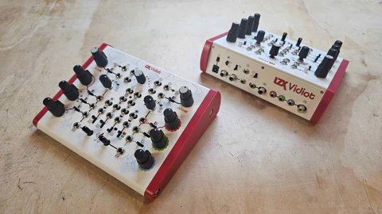
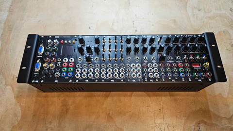
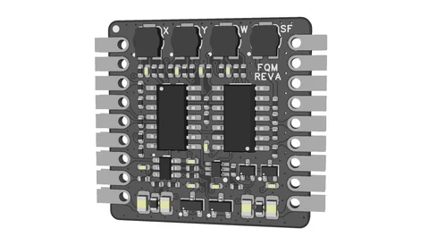

September flew right past us here at LZX, with steady (if tedious) progress toward Chromagnon production on my end, and multiple longer term production projects wrapping up in the workshop.

<!-- truncate -->

During spring cleaning earlier this year, we uncovered our remaining stock of Vidiot specific production parts, such as enclosures and side panels.  Rather than sending them to the junk, we've been making progress over the Sumer on building up a limited batch of 24 units using those parts.  You can order one now at https://lzxindustries.net/products/vidiot

We've made some revisions to our Double Vision system bundle -- including a full 3U EuroRack enclosure using our new sync and power distribution board architecture.  This version also includes the TBC2 expander, in lieu a DC Distro.  We have a couple systems in stock right now for purchse: at https://lzxindustries.net/products/double-vision-system

On the Chromagnon front, I have been laser focused (pun intended) on preparing the hardware for production.  After this last prototype review, the full context is a lot easier to see, including the remaining steps needed until we're actually placing the order for production core boards and molded parts. This process has been grueling, as the core board's BOM and parts count are massive. Thus, I've been breaking some repetitive parts of the analog circuit into submodules. 

The first of those submodules is a four quadrant multiplier sub-assembly that encapsulates our discrete design. This design is based on topologies in classic multiplier ICs such as MC1494 and MC1495, which are long obsolete.  A core requirement of the Chromagnon design is the implementation of this discrete multiplier, as there are over 20 of them in its analog circuit!  We've been working on this circuit since before Chromagnon was even conceived, and after so many revisions I'm very pleased with how it is performing.  Here's a look at the submodule.  

This submodule is being reintegrated into Chromagnon's core board, which reduces the BOM count by a few hundred parts and will allow pre-testing/calibration of the analog circuit. We have already received our initial order of these submodules and are testing them now. 

Revisions to Chromagnon Core RevH will be ordered by the end of this week.  I'm not used to spending entire weeks on a single PCB layout, so that gives you an idea of the scale of the effort required to push this forward. This is the first version of the board that is being 100% assembled out of our workshop, which means we're priming it to be ready to go, and it is a candidate for production.  I'd love to have it all confirmed and initial quantities ordered by the end of October -- there's not a lot left to stand in our way of that happening.

And now, here are answers to the questions you have submitted since the last update:

**Marty asked, "Looking forward to shipping on Chromagnon. Well done on all the work so far. When shipping does occur. Will the cost of the unit, detailed for customs. Reflect the date of purchase or current value? I'm just worried about the extra tax I'm going to pay when it ships to Australia."**

Hi, Marty. The customs info will reflect the price you paid on your original sales invoice.

**Pat asked, "Can we expect Chromagnon unit #1 to ship out by Halloween?"**

Probably not, Pat!  In the next Chromagnon milestone, I'm hoping to be telling you we've got RevH confirmed and have ordered initial production parts. That is getting very close, and would mean we have unit #1 here. Whether or not it's shipping by that date, I don't know -- firmware is about 95% done, but there's still a few items to wrap up and test once the hardware is sealed.  

**Paul asked, "Would it be possible to demonstrate through your LZX documentation learning program, the placement and attachment of modules into a Vessel or eurorack case? And if any modules have to be linked together or sync. This is for those who don’t know. Thank you."**

Hi Paul. Yes, certainly! We do have a basic guide to doing this on our website at https://lzxindustries.net/getting-started. However, I'd love to expand on that and have some videos and better photos to go along with it.

Until next time,
Lars