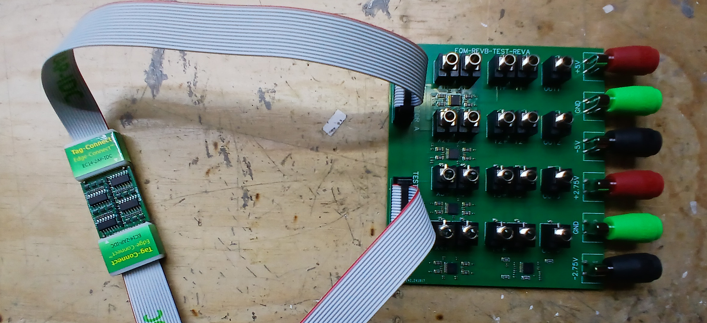
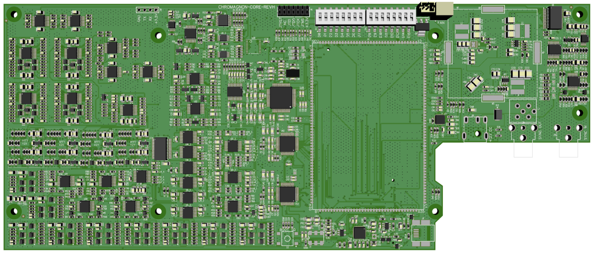
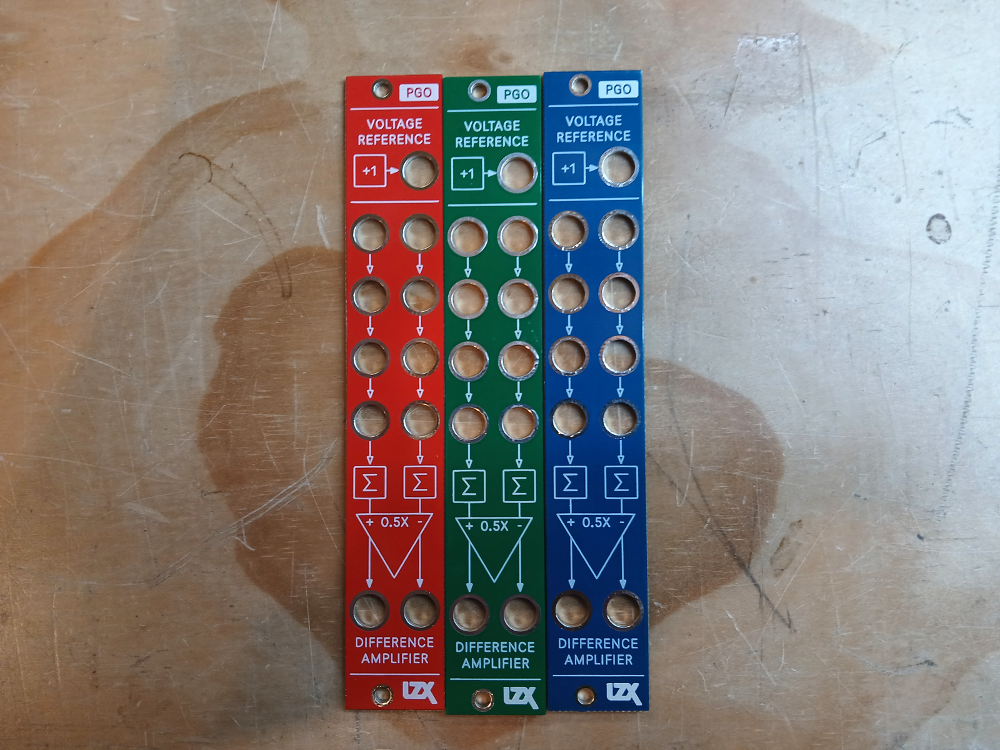

Hello video fiends -- we hope everyone had a spooky Halloween! 

Per my last missive at the beginning of October, I was focusing in on revisions to the Chromagnon Core RevH board.  The plan was to have those revisions complete and the board reviewed before the end of October, and I was developing multiple discrete submodules to aid in that task. I'm happy to say that the board is now ordered, but with a few weeks of hassle -- both in the revision process, and the coordination process with our external vendor.

<!-- truncate -->

*A discrete quad multiplier subassembly and testing jig*

After racing between various solutions, I was able to settle on one that did not require submodules at all, in order to fit the full circuit onto the existing assembly -- which is a good thing, for Chromagnon.  

*Chromagnon Core RevH*

The board's BOM is so big it was causing issues with the vendor's system initially -- thankfully they were able to resolve that, but it cost us over a week.  I wanted to hit this milestone before publishing a new blog.  It's nice to be writing this one knowing that assembly is underway, and that I'll be able to begin testing RevH immediately when it arrives in the latter half of November.

Despite being behind where I wanted to be at the end of October, this milestone is quite exciting.  With the off site assembly process flowing smoothly, we have the stage set for formal production when it is go time.   I look forward to writing another update about Chromagnon toward the end of the month.

In other news, in the time in between Chromagnon tasks, I have been working on our new documentation website at https://docs.lzxindustries.net.  You may be there already, as it is the new location for this blog.  Most of the content is hidden from public view for now, but I'm quite happy with how the illustration and writing process is going so far.  We'll be migrating most content from our current website to this new static site soon -- including all module documentation, resources and articles. 

Finally, here's a teaser of a new module we have been working on. It will be available as a DIY project as well as assembled.

We'll tell you more about it and more about the docs site in the next update.  I have a little over a week before my Chromagnon board arrives, to make some progress in these areas.

Other news: more Double Vision systems are being built this month and are available to order now.  We have healthy stock of most Gen3 modules, if you're looking to pick up something new for your system this Fall.

Thanks for reading -- please write in using this form if you have questions: https://wkf.ms/47lhPPA
