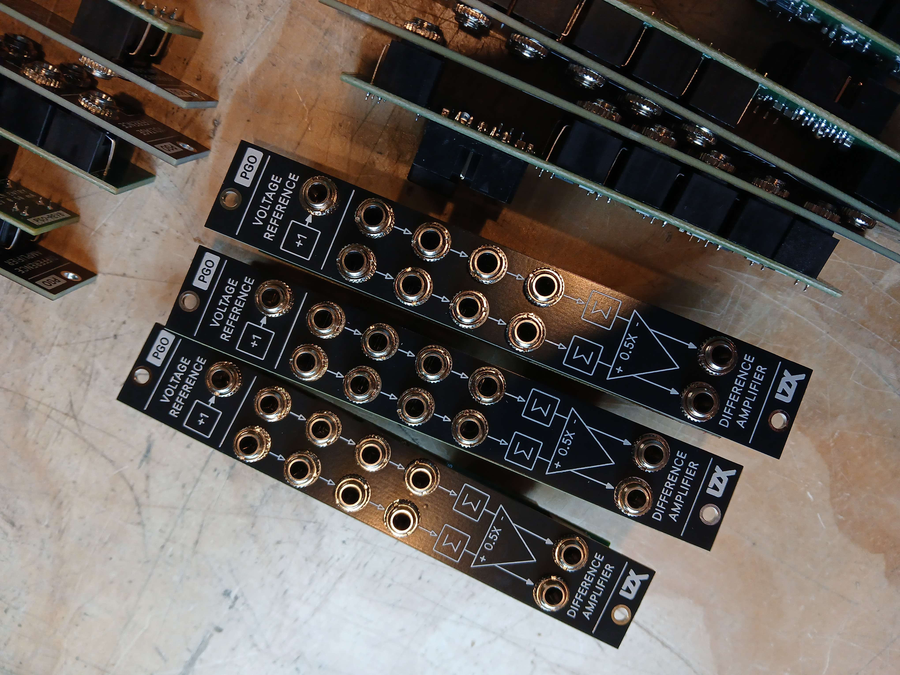
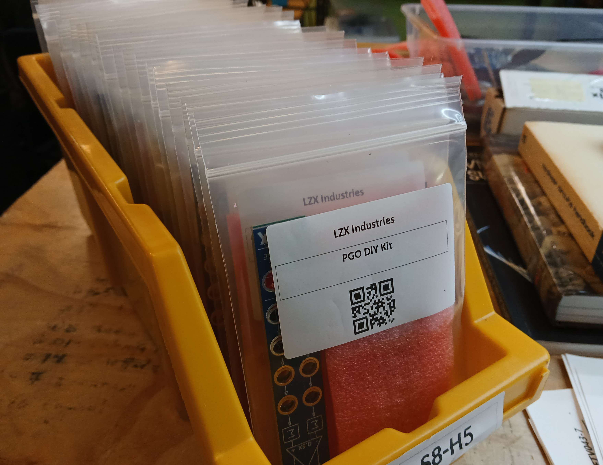
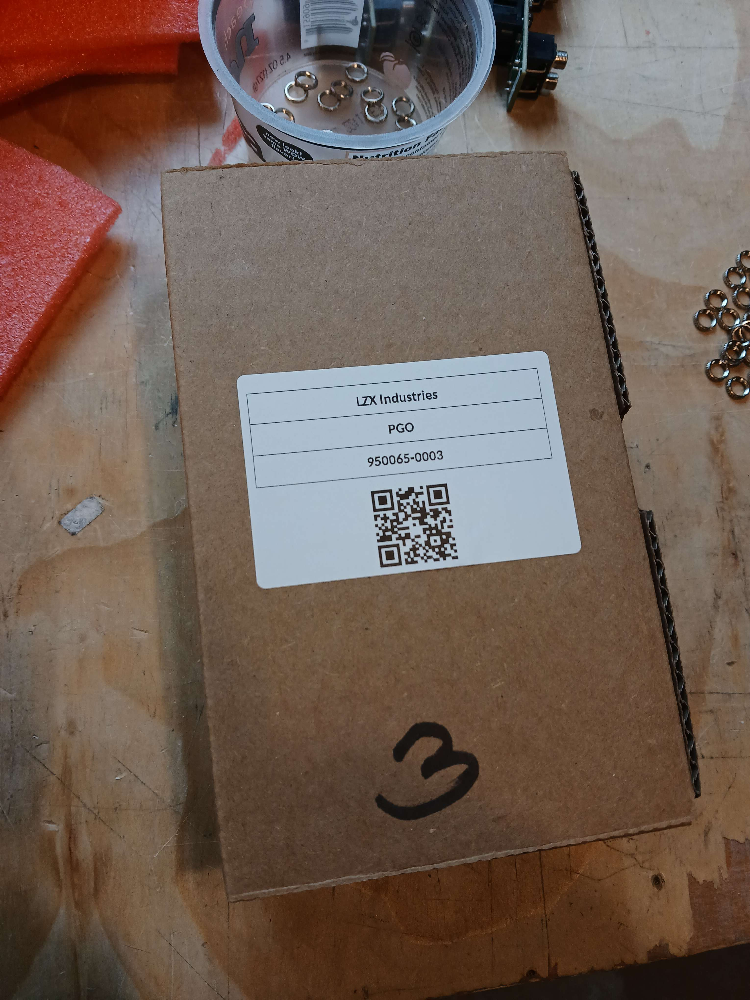
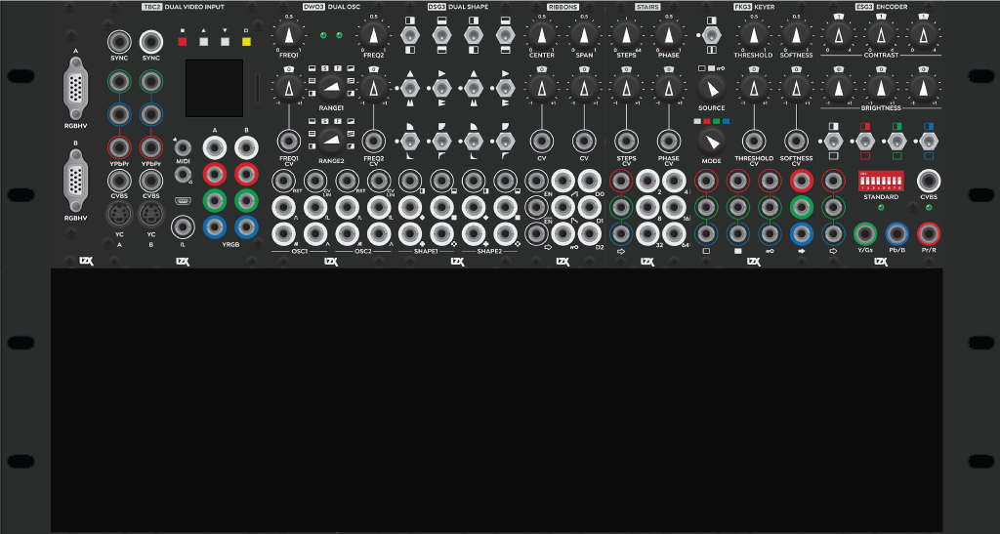
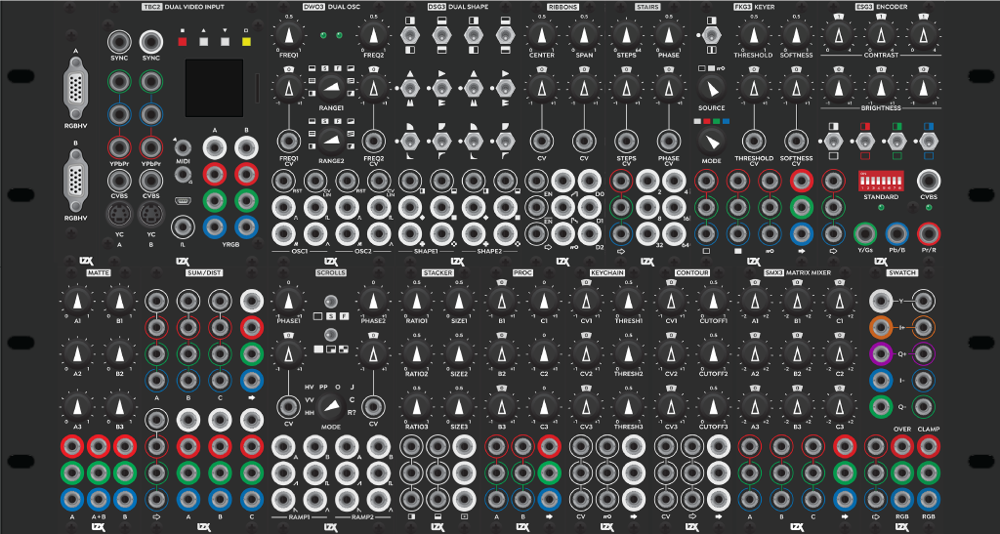
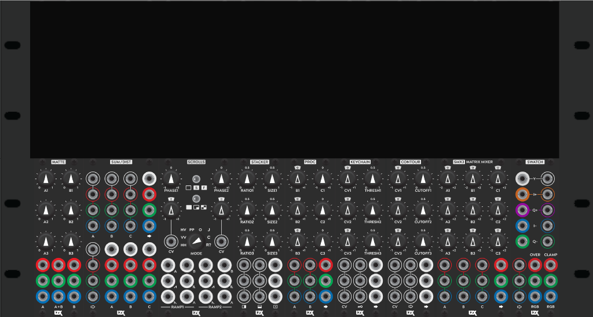

Hi Vidiots & Vidiettes! We're happy to say we got the shipping notification for the Chromagnon Core PCB prototypes mentioned in the last blog today.  The next update will focus on that -- in this one I wanted to provide a few updates about projects we are working on to keep the company running as we get through the final milestones with Chromagnon. 

The first is a new module, PGO, a 4HP Programmable Gain & Offset processor, which is now available.

<!-- truncate -->

This module is the first in a new series of modules titled P Series, which will focus on core utility modules that are available in both assembled and DIY forms.  We have also used PGO to prototype a more complete approach to our product documentation, and you can see what that looks like here at https://docs.lzxindustries.net/docs/modules/pgo.  P Series can be considered the successor to Cadet series, as well as Expedition modules providing raw functions, such as Bridge and Arch. We have a few more planned, and we'll release them over the upcoming months. 

PGO may not appeal to every video synthesist -- it is a raw function, and is the kind of module you can use as a building block in patching more complex custom functions. For myself, I'm very excitd to have 16 of them in their own rack, and using that rack for future development ideas.  For existing Gen3 owners, you could use it this way -- or in a few other contexts as well.  Check out the docs linked above for more on that topic.

In other news, we have a few new variations for the Double Vision System available.  The first is the option to purchase Double Vision with our 168HP modular case, allowing 84HP of empty space to grow into.  

The second is an expanded Double Vision system including 168HP of Gen3 modules.  

The third is an expander for existing Double Vision owners, allowing you to upgrade your existing Double Vision to the 168HP and 84HP of new modules.

We have stock of these variants available now. 

Let's answer your questions!

*Van Ta asked, "Those 4Q multiplier submodules from the last entry look really exciting. Are you planning to sell them as well for DIYers?"*

I'd like to!  I'm not sure what form that will take yet, in light of the P Series DIY modules, and our next development plans. The next P Series module is a programmable comparator, switch, and multiplier combo function. Since it is a 4HP module, I'm going with an IC based multiplier for the first prototype. The discrete cell designs are probably most practical in the context of a DIY rotator or matrix multiplier module. If I don't do something specific with the boards I developed, I will consider releasing the designs so others can dig in.

*Asjave asked, "Does the Double Vision system have everything in the Chromagnon and more, or are there features in Chromagnon that don't exist in the Double-Vision system? Thank you!"*

Double Vision and Chromagnon are entirely different video synthesizers, with different internal functions.  They are similar in that they can both process an SD/HD analog video signal, and perform various shape generation, pattern synthesis, feedback, and colorization effects.  But the specifics are quite different.  The biggest functional add for Double Vision is its open ended patchability and being able to mix and process two external video sources.  You could consider Chromagnon a *video processor*, and Double Vision a *video mixer.*

*Sig asked, "Any chance the new TBC2 VGA expander comes with an EDID chip? If not, would you consider this for a future version? I think it would be a really nice feature."*

Hi Sig, no -- the VGA expander doesn't have an EDID chip, but that is an interesting proposal.  In its current architecture, TBC2 is designed to auto-detect the incoming video format and, if supported, lock to it. An EDID chip would allow the transmitting device to read the supported input formats and present those as valid options to the user.  Since you can see the supported TBC2 input formats in our documentation, you should be able to configure your device appropriately as it is -- but I can understand why the EDID chip would be a nice thing to have. 

*Pat said, "Hi! I just finished reading the latest monthly journal entry (November). It sounds like you guys are making some great progress but I'm a little confused with all the technical talk and where Chromagnon sits along the timeline of being finished. Would it be possible to include some type of metric in each post for the layman? Say, like a percentage of completion where 100% means the unit is ready to ship? I appreciate all the details but it's hard for me to figure out what it all means in the big picture."*

I understand -- I appreciate that the jargon may be frustrating to read when you are looking for an answer to a simple question. At the beginning of the year on January 5th's blog, I outlined 3 milestones to completing this project:

- Production ready
- Ship unit one
- Ship all pre-orders

Since there are so many moving pieces involved in the project, it would be difficult to quantify *percentage complete* in terms of the overall ongoing project.  For example, most of the production work is already done, since Chromagnon's control board assembly went into production back in 2021-2022. Going into this year, the "Production ready" milestone includes finalizing parts design, PCB design, and firmware.  Compared to where we were in January, parts design is 100% done, PCB design is *pending* 100% done, and firmware is 95% done.  We were at this state back in August too, but the most recent PCB design needed more work, and it took a few weeks to make that revision.  So in other words, *if* no more hardware revisions are neccessary on this incoming prototype -- we will be moving past the Production ready milestone finally, before the end of the year.  The leap from Production Ready to Ship Unit One is not so big, and much easier to estimate. It will happen right after production ready, as most of the tasks involved in prepping for that next milestone have already been completed.  I hope this helps you understand better where we are with the project. 

*Dan asked, "Do you think Chromagnon will be shipping by Christmas 2024?"*

It is quite possible we will reach the Ship Unit One milestone (see above reply to Pat) before the end of the year. Sometime in December, after reviewing the next incoming PCB prototype, I will know for sure.

Thanks for reading -- please write in using this form if you have questions: https://wkf.ms/47lhPPA
