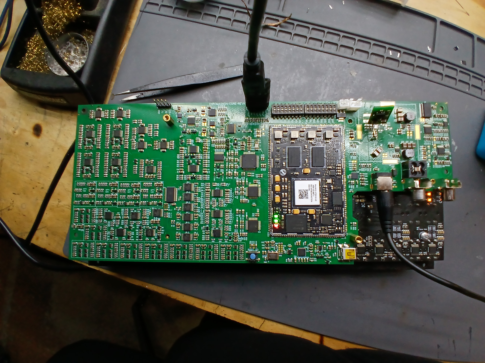

Happy New Year from us here at LZX! We are grateful for an opportunity to be part of your creative lives and wish you triumphant returns on all of your endeavors in 2025. It is our fifteenth year of offering tools to you, and our eighteenth year of developing analog video synthesizers. I feel very excited about our point of view on our existing and future projects at LZX, and 2025 should be fun year.

<!-- truncate -->

The requested Chromagnon recap:  2024 started off strong, with the launch of this production blog, and a new redesign of the Chromagnon Core assembly: RevF.  This assembly was designed to put all the remaining assembly work onto a single board, so that we could finally start shipping the project.  Our plans moved strongly thru the RevF review, but there were still several functional changes that needed to be made.  Then we got hit with the unexpected: sales slowed drastically this year, forcing us to downsize.   

Moving into the Summer, we lost a few months of Chromagnon time scrambling to update processes and keep the business flowing.  By the end of the Summer, this task was done, and the second Chromagnon revision for the year was in review: RevG.  During the late Summer and into the Fall I wrote Chromagnon's firmware, as RevG was complete enough to write all the firmware functionality.  But there were still a few issues to resolve with the hardware, so in October I heavily into the RevH revisions.  With this revision, we also needed to integrate Chromagnon into our workflow outsourcing SMT assemblies.  

The RevH order was sent in November, and review of the RevH prototype has been ongoing (and successful) since early December, with a couple of bumps in the road that required us to pick it up and put it back down a couple of times while waiting for parts. So, going well, but not going fast. The review is almost complete, and after it's done I'll make another blog post about what's next. We are close to our "ship unit one" milestone, which is when a complete hardware unit goes to a beta tester. That might be RevH, or it may be RevI -- not positive yet.

What else did we do in 2024?  We launched our new 6U case design, and our first packaged system: Double Vision.   We also released the utility module PGO, and we said goodbye to Vidiot, with a limited run of 24 units using our remaining stock of enclosures.

What else will we do in 2025?  We have a few new module designs nearing readiness we are excited to introduce.  We will also keep building and expanding on the documentation website, and providing some fresh content for existing modules.

What would you like to see from LZX this year? We'd love to hear all about your needs.

Talk again soon,
Lars

