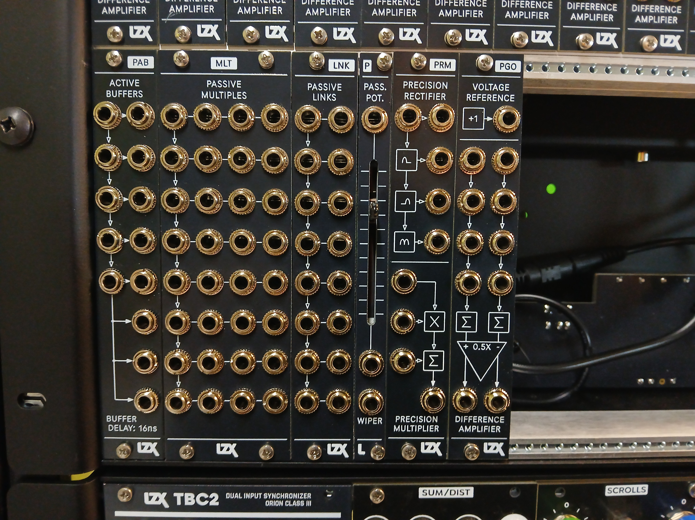

Hi video friends,

I'm writing to provide you with the news about current and ongoing projects at LZX.

The current Chromagnon Core PCB RevI revision remains a work in progress. Following the release of this version, I expect to move into fulfillment plans and scheduling. I'm currently weighing a few options which will have a big impact on how that all goes, and playing catch up on projects delayed in January and February.  The pace at which progress can be made with Chromagnon is set by the health of our sales and the synth industry in general, and this year has started roughly in that regard.  Despite that, I remain confident that LZX and Chromagnon will pull through strongly. 

After a year's hiatus, we released our first new module in November last year: PGO.  We now have five more in this series available, in what we are calling the P series: modules which fit one of the three themes: Passive, Precision or Programmable.  P Series functions are not complex, exciting video effects on an individual basis: they are the building blocks of them. Those of you who wish to dig into the nuts and bolts of analog graphics will find that all the right operators are here to patch most of the functions in our other modules.  As we consider revising earlier modules and developing  new modules, this series provides a chance to encapsulate our best practices in video synth module design thus far, and provide a solid foundation on which to do so.  

PROGRAMMABLE

- PGO: 4HP Programmable Gain & Offset
- PAB: 4HP Programmable Active Buffers

PRECISION

- PRM: 4HP Precision Rectifier & Multiplier

PASSIVE

- MLT: 8HP Passive Multiples
- LNK: 4HP Passive Links
- P: 2HP Passive Potentiometer

All P Series modules are available in 3 variants:

- Fully assembled, including any power cables
- Full DIY kit, all parts included
- Partial DIY kit, SMT assemblies and frontpanels only

There has also been a price drop on the PGO partial DIY kit.

Other modules in development for 2025 include:

- An RGB-to-HDMI encoder.
- A system sync/waveform generator, with support for legacy connectors and some new tricks.
- A sync distribution amplifier with front and rear connectors, for sync connections with external devices and expander cases.
- An extended version of our first rotator module (Navigator) merged with features from our polar-to-cartesian module (Colorspace Mapper/Mapper).

In parting, check out some new documentation work by our collaborators.  There are beautifully illustrated and animated docs now available for DSG3, Angles, Keychain and Proc.  There are also initial drafts up for the P Series modules. 
https://docs.lzxindustries.net

We'll continue regularly adding to the docs throughout 2025.  Please let us know what you think of them.

Until next time,
Lars