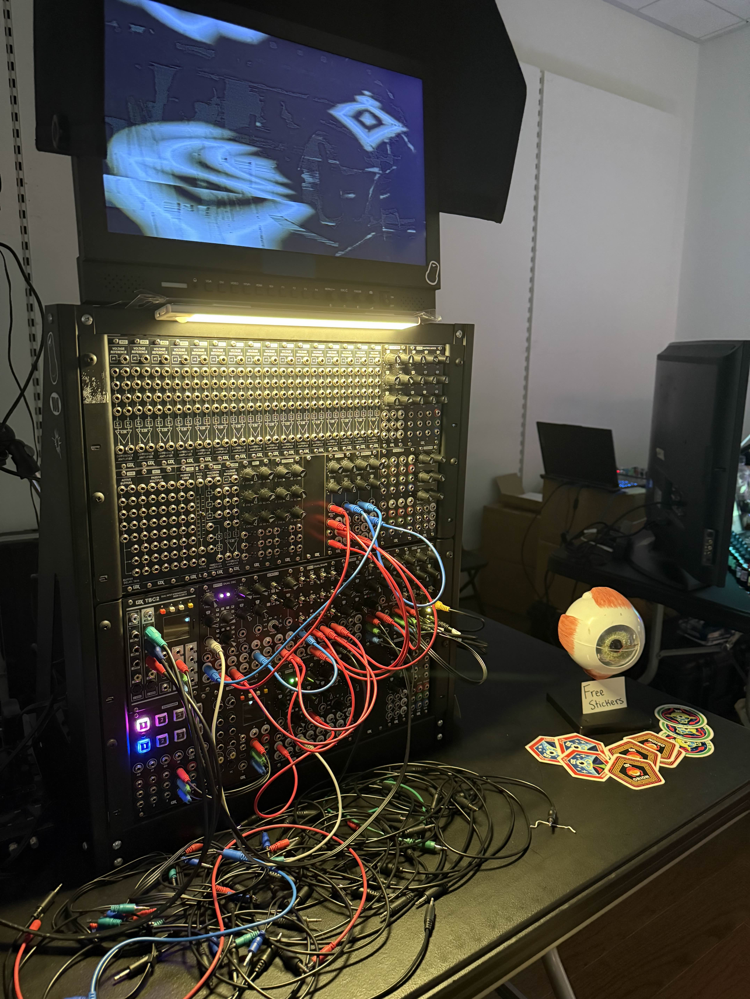
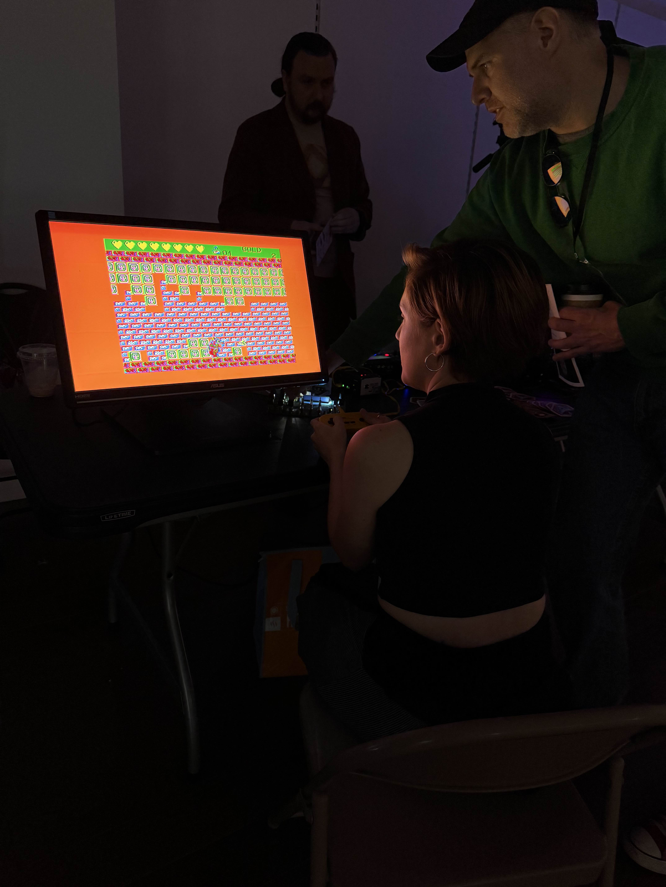
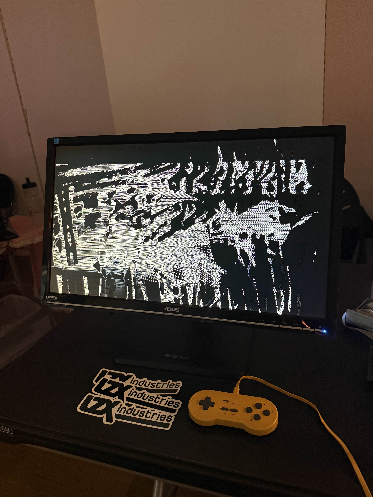
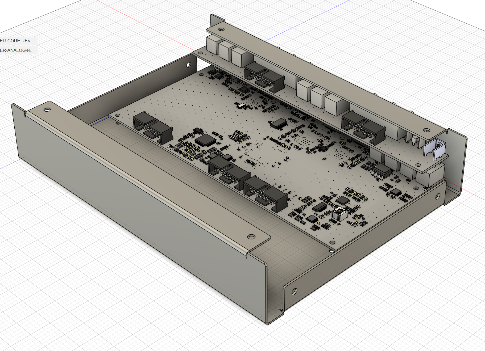
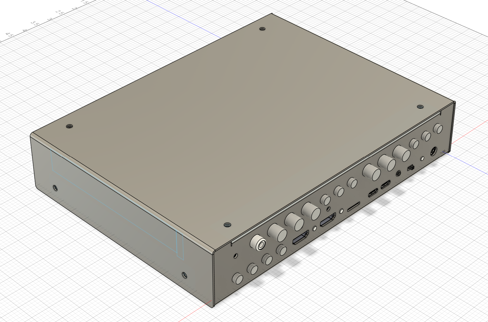
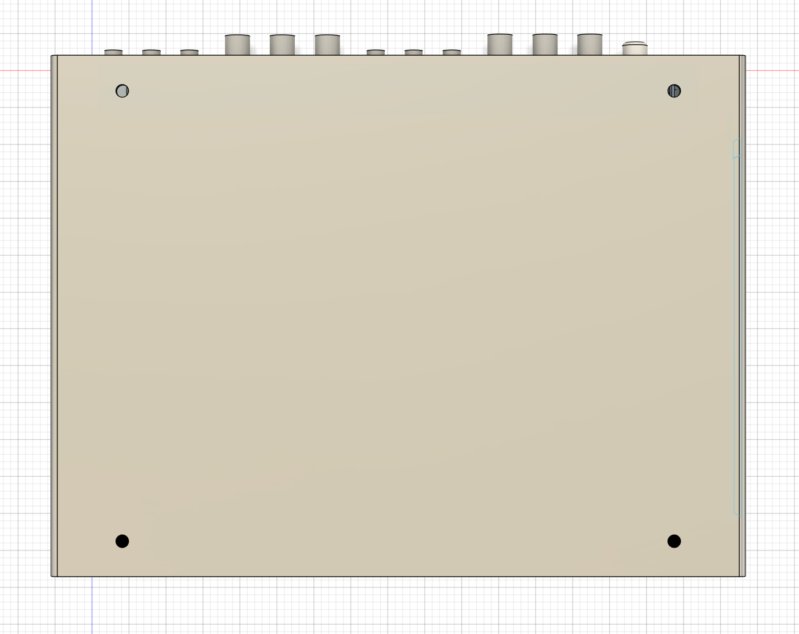
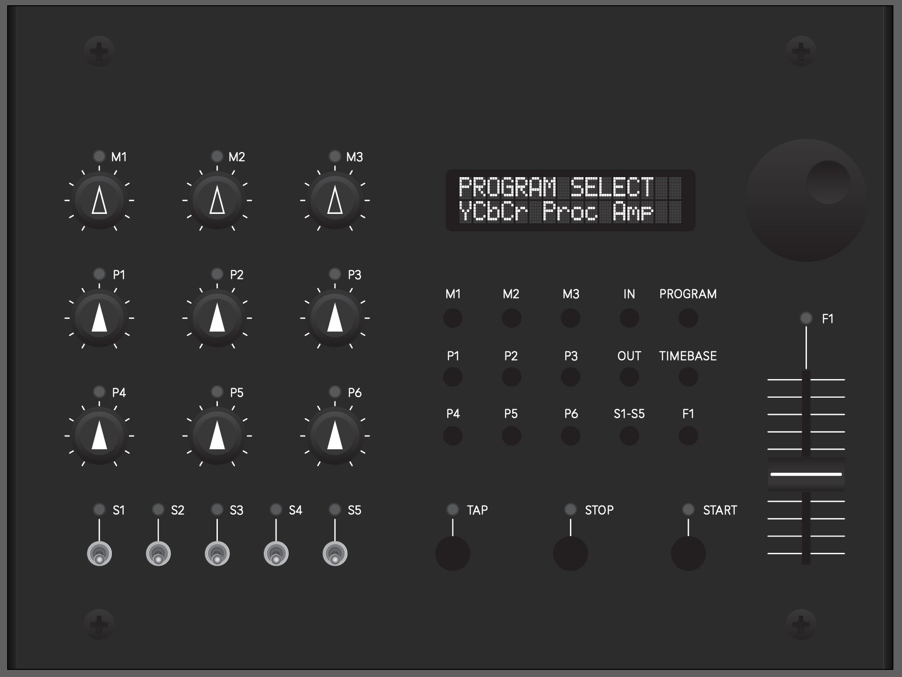

We had a wonderful time at Video Sync 2025 here in Portland, OR earlier this month. Our endless thanks to all of the organizers and volunteers involved in the event! I would love to journal about some of my personal highlights and the people I met, but will save it for a less crowded post. 

<!-- truncate -->

What's up next for LZX? This year has required some massive juggling of our priorities in response to the fluctuating new tariffs, which have effectively demolished our plans going into this year. We were hoping to be shipping Chromagnon by the end of the Summer, but have spent most of the past few months scrambling to keep the lights and figure out how we are going to continue making our products. We have been doing a lot of assessment and planning in August, and despite it all, we remain optimistic about the road ahead. I will break down the specifics in future updates, but here is the top level plan.

*Going into September,* we are finishing a large number of in house production projects, and will be caught up on backorders made over the Summer.

*By the end of September,* our new multi-effects console, Videomancer, will be in production.  During this time we will be polishing the firmware release for Videomancer while also revising Chromagnon hardware to implement  new circuits that were designed and validated for Videomancer.

*By the end of October,* we will be shipping Videomancer units.  Sales will initially be limited to whatever we have been able to build up to that date or already have in production.  By your request, Chromagnon pre-order customers will be e-mailed a code to allow early access to purchases of Videomancer a few days before the public launch date.

*In early November,* we will be validating and writing firmware for the revised Chromagnon hardware.  We plan to share a lot of media as we go through this phase.

*By the end of December,* we expect to have the new build of Chromagnon ready to go into final assembly and fulfillment in January of 2026.

*What are the big risks of getting off course?*  If the Videomancer launch does very poorly, we may have to reassess our ability to hit this end of year milestone with Chromagnon.  The business is lacking a core cashflow related product right now, and we are depending on Videomancer to be that.  In the past, we've had a lot of unplanned delays related to forecasting firmware development time -- but in the cases ahead of us, I do not think we will.  All of the firmware validation of the platform to be used in Videomancer and the Chromagnon revisions has been accomplished over the Summer, and we're very happy with how it's performing. In other words, the hard parts are already done, which makes it easier to predict the timing of what is next.

*How fast will Chromagnon fulfillment happen?*  By the time we hit the hardware/firmware milestone mentioned above, we should be able to assess our position on this better.  But there are two ways we expect it could go.  If we are doing strongly after the Videomancer launch and sales season, we will build Chromagnon in large batches, outsourcing extra help, and hoping to ship all orders in 1-3 wave of shipments.  If that is not possible, we will be merging Chromagnon into the Videomancer production pipeline and start making monthly shipments of a variable number of units dependent on our logistical constraints at the time. With the global economy in flux right now, we don't have a way to forecast.

Here are a few images to share from Videomancer development.  This must be considered a behind-the-scenes slideshow, so please don't take anything you see here as a final answer (especially the UI mockup!)

Excited to check in with you all again in September,
Lars